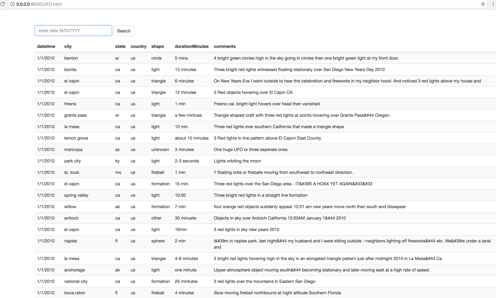

JS 
To display UFO sighting data in HTML format, taking the json file and coverting it into a JS file that can be read by the HTML code.

Notes:

- Added functionality to filter by date: located in index.js file:
        Function handleSearchButtonClick()

        

- Used basic css for styling and sourced data from data.js

