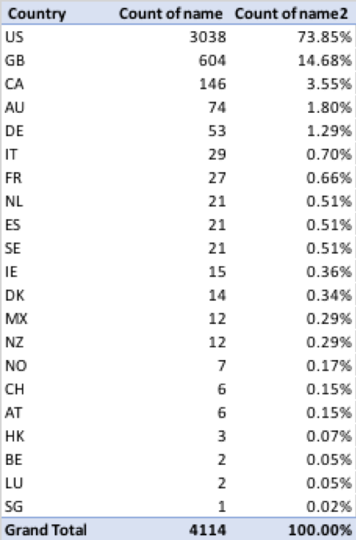

Kickstarter
Melody Lamphear
Kickstarter project analysis takeaways:

1.	What are three conclusions we can make about Kickstarter campaigns given the provided data?

-	The overall success rate for all projects in this data set is 53%, the failed rate is only 37%. The most popular categories in the sample are Theater and Music, both of which have the highest success rates:

Success rate by category:

Outcome by category:

-	Journalism and food categories seem to have the least chance of success: 
o	100% of all journalism projects were canceled, indicating that there is a low confidence level that these kinds of projects will be funded 
o	Within food projects, 86% of food truck projects failed and the balance were canceled.

-	Projects with goals that are less than $1,000 have the highest change of success, followed by those under $5,000

2.	What are some of the limitations of this dataset?
-	The data could be skewed by the fact that the categories with the highest number of projects show the highest rates of success. The journalism category has the least number of projects and all of them were canceled. Without knowing the root cause for this, we cannot make a determination on whether any projects in this category can be successful or not, as the sample is not big enough.
 

-	Another limitation of the data is that it utilizes different currencies, which means that we cannot make true comparisons between goal numbers. We would need to research currency conversion rates for each of the time periods indicated, and convert to a single currency to provide an accurate comparison.

3.	What are some other possible tables/graphs that we could create?
-	To understand the data, we should review tables that show percentage of total by country and notice that the majority of the projects are based in the US:

-	Dissecting the data by goal size shows that 51% of projects have goals of under 10,000:

-	As noticed earlier, all journalism projects were canceled. This makes us wonder what drives the lack of confidence in this kind of project. One potential answer could be that the goals are too high. To analyze goal sizes for those projects that show high failure/cancel rates we need to create a table showing subcategory, name and goal size by project: 

-	By creating a bar chart, we can see that the number of projects by year show a spike in 2015:

-	Lastly, we can leverage regression analysis to see whether the pledge amount is driven by the number of backers. Below table reflects a relatively high coefficient of determination, which means that differences in pledge quantities can be explained by a difference the number of backers: 

