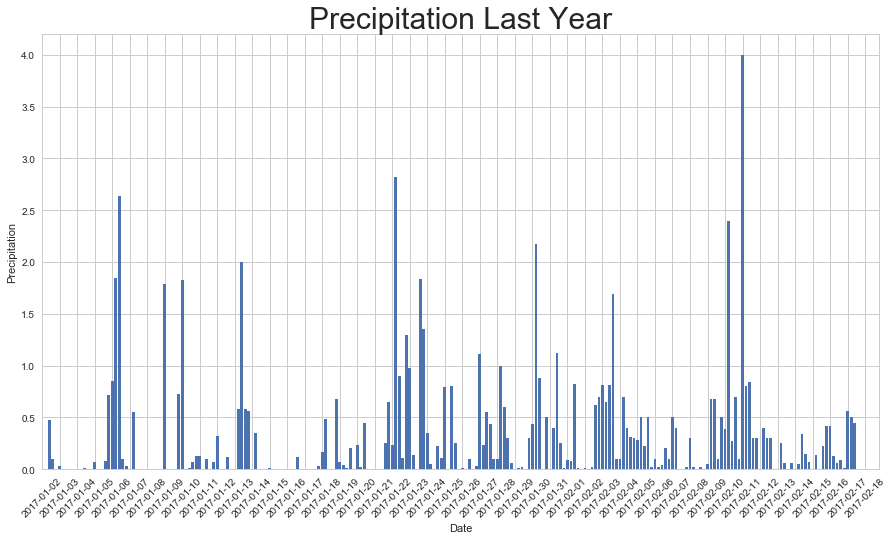
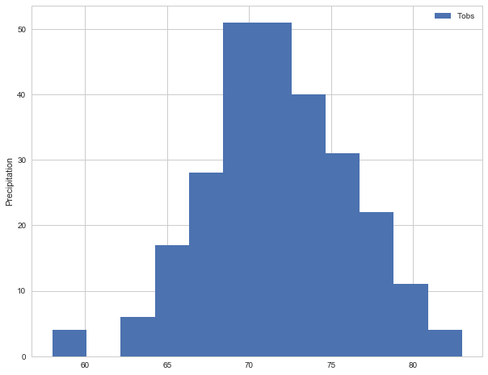
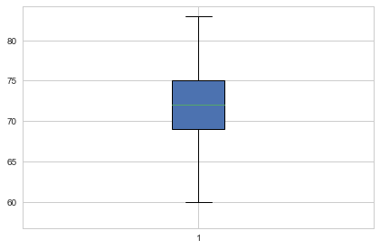

***Precipitation analysis***

- Vacation dates: July 20th - July 31st


```python
import sqlalchemy
from sqlalchemy.ext.automap import automap_base
from sqlalchemy.orm import Session
from sqlalchemy import create_engine, inspect
import pandas as pd
from sqlalchemy import func
from sqlalchemy import text
import datetime as dt
import matplotlib.pyplot as plt
import seaborn as sns
import numpy as np
import calendar
```


```python
engine = create_engine("sqlite:///hawaii.sqlite")
```


```python
conn = engine.connect()
```


```python
Base = automap_base()
Base.prepare(engine, reflect=True)
Base.classes.keys()
```


    ['measurement', 'station']


```python
MEASURE = Base.classes.measurement
```


```python
STATION = Base.classes.station
```


```python
session = Session(engine)
```


```python
inspector = inspect(engine)
inspector.get_table_names()
```


    ['measurement', 'station']


```python
columns = inspector.get_columns('measurement')
for c in columns:
    print(c['name'], c["type"])
```

    id INTEGER
    station TEXT
    date TEXT
    prcp FLOAT
    tobs INTEGER


```python
session.query(MEASURE.date, MEASURE.prcp).\
filter(func.strftime("%Y-%m-%d",MEASURE.date) > "2017-01-31").group_by(MEASURE.prcp).order_by(MEASURE.prcp).all()
```


    [('2017-07-31', 0.0),
     ('2017-06-07', 0.01),
     ('2017-07-10', 0.02),
     ('2017-05-07', 0.03),
     ('2017-06-29', 0.04),
     ('2017-08-07', 0.05),
     ('2017-08-03', 0.06),
     ('2017-08-10', 0.07),
     ('2017-07-04', 0.08),
     ('2017-08-19', 0.09),
     ('2017-07-21', 0.1),
     ('2017-04-27', 0.11),
     ('2017-02-25', 0.12),
     ('2017-08-17', 0.13),
     ('2017-08-12', 0.14),
     ('2017-08-09', 0.15),
     ('2017-07-17', 0.16),
     ('2017-03-24', 0.17),
     ('2017-07-07', 0.18),
     ('2017-06-21', 0.19),
     ('2017-06-30', 0.2),
     ('2017-07-17', 0.21),
     ('2017-08-14', 0.22),
     ('2017-05-09', 0.23),
     ('2017-06-18', 0.24),
     ('2017-08-02', 0.25),
     ('2017-04-03', 0.26),
     ('2017-07-19', 0.27),
     ('2017-06-22', 0.28),
     ('2017-04-14', 0.29),
     ('2017-07-30', 0.3),
     ('2017-06-20', 0.31),
     ('2017-02-22', 0.32),
     ('2017-07-20', 0.33),
     ('2017-08-08', 0.34),
     ('2017-04-23', 0.35),
     ('2017-06-24', 0.36),
     ('2017-04-29', 0.37),
     ('2017-04-15', 0.38),
     ('2017-07-17', 0.39),
     ('2017-07-28', 0.4),
     ('2017-03-05', 0.41),
     ('2017-08-16', 0.42),
     ('2017-03-25', 0.43),
     ('2017-05-23', 0.44),
     ('2017-08-23', 0.45),
     ('2017-05-18', 0.46),
     ('2017-04-16', 0.47),
     ('2017-03-25', 0.48),
     ('2017-04-16', 0.49),
     ('2017-08-22', 0.5),
     ('2017-03-06', 0.51),
     ('2017-05-09', 0.52),
     ('2017-06-10', 0.53),
     ('2017-03-03', 0.54),
     ('2017-05-10', 0.55),
     ('2017-08-21', 0.56),
     ('2017-03-02', 0.58),
     ('2017-04-13', 0.59),
     ('2017-05-15', 0.6),
     ('2017-07-24', 0.61),
     ('2017-06-10', 0.62),
     ('2017-06-13', 0.65),
     ('2017-02-16', 0.67),
     ('2017-07-14', 0.68),
     ('2017-04-14', 0.69),
     ('2017-07-20', 0.7),
     ('2017-02-11', 0.73),
     ('2017-06-11', 0.74),
     ('2017-04-28', 0.76),
     ('2017-04-28', 0.79),
     ('2017-07-23', 0.8),
     ('2017-06-14', 0.81),
     ('2017-06-04', 0.82),
     ('2017-07-24', 0.84),
     ('2017-05-25', 0.88),
     ('2017-04-30', 0.89),
     ('2017-04-15', 0.9),
     ('2017-03-25', 0.93),
     ('2017-05-08', 0.95),
     ('2017-04-18', 0.98),
     ('2017-05-14', 1.0),
     ('2017-04-22', 1.01),
     ('2017-04-30', 1.04),
     ('2017-04-21', 1.05),
     ('2017-02-12', 1.07),
     ('2017-02-08', 1.08),
     ('2017-05-08', 1.11),
     ('2017-05-30', 1.12),
     ('2017-04-21', 1.16),
     ('2017-04-30', 1.17),
     ('2017-07-24', 1.19),
     ('2017-04-30', 1.21),
     ('2017-04-17', 1.3),
     ('2017-04-30', 1.31),
     ('2017-02-07', 1.32),
     ('2017-04-22', 1.35),
     ('2017-03-02', 1.45),
     ('2017-03-02', 1.48),
     ('2017-05-09', 1.58),
     ('2017-05-09', 1.62),
     ('2017-06-15', 1.69),
     ('2017-02-11', 1.73),
     ('2017-04-21', 1.74),
     ('2017-02-07', 1.79),
     ('2017-02-07', 1.8),
     ('2017-02-12', 1.83),
     ('2017-04-21', 1.84),
     ('2017-03-02', 1.88),
     ('2017-02-12', 1.91),
     ('2017-03-01', 2.0),
     ('2017-04-18', 2.03),
     ('2017-03-01', 2.12),
     ('2017-05-24', 2.17),
     ('2017-03-01', 2.2),
     ('2017-04-14', 2.3),
     ('2017-04-21', 2.36),
     ('2017-02-11', 2.39),
     ('2017-07-18', 2.4),
     ('2017-04-28', 2.6),
     ('2017-02-12', 2.62),
     ('2017-04-14', 2.82),
     ('2017-02-13', 2.9),
     ('2017-02-12', 2.98),
     ('2017-07-22', 4.0),
     ('2017-02-11', 5.04),
     ('2017-04-29', 6.25)]


```python
L12_df = pd.DataFrame(session.query(MEASURE.date, MEASURE.prcp).\
filter(func.strftime("%Y-%m-%d",MEASURE.date) > "2017-01-01").group_by(MEASURE.date).order_by(MEASURE.date).all())
L12_df.columns=["date", "prcp"]
L12_df.head(10)
```


<div>
<style scoped>
    .dataframe tbody tr th:only-of-type {
        vertical-align: middle;
    }

    .dataframe tbody tr th {
        vertical-align: top;
    }

    .dataframe thead th {
        text-align: right;
    }
</style>
<table border="1" class="dataframe">
  <thead>
    <tr style="text-align: right;">
      <th></th>
      <th>date</th>
      <th>prcp</th>
    </tr>
  </thead>
  <tbody>
    <tr>
      <th>0</th>
      <td>2017-01-02</td>
      <td>0.00</td>
    </tr>
    <tr>
      <th>1</th>
      <td>2017-01-03</td>
      <td>0.00</td>
    </tr>
    <tr>
      <th>2</th>
      <td>2017-01-04</td>
      <td>0.00</td>
    </tr>
    <tr>
      <th>3</th>
      <td>2017-01-05</td>
      <td>0.47</td>
    </tr>
    <tr>
      <th>4</th>
      <td>2017-01-06</td>
      <td>0.10</td>
    </tr>
    <tr>
      <th>5</th>
      <td>2017-01-07</td>
      <td>0.00</td>
    </tr>
    <tr>
      <th>6</th>
      <td>2017-01-08</td>
      <td>0.03</td>
    </tr>
    <tr>
      <th>7</th>
      <td>2017-01-09</td>
      <td>0.00</td>
    </tr>
    <tr>
      <th>8</th>
      <td>2017-01-10</td>
      <td>0.00</td>
    </tr>
    <tr>
      <th>9</th>
      <td>2017-01-11</td>
      <td>0.00</td>
    </tr>
  </tbody>
</table>
</div>


```python
plt.figure(figsize=(15,8))
sns.set(style="whitegrid")
plt.bar(L12_df["date"], L12_df["prcp"])
plt.xlabel("Date")
plt.ylabel("Precipitation")
plt.xticks(np.arange(1,240, step=5), rotation=45)
plt.xlim(1,240)
plt.title("Precipitation Last Year", size=30)
plt.show()
```





```python
stats =  L12_df.describe()
stats
```


<div>
<style scoped>
    .dataframe tbody tr th:only-of-type {
        vertical-align: middle;
    }

    .dataframe tbody tr th {
        vertical-align: top;
    }

    .dataframe thead th {
        text-align: right;
    }
</style>
<table border="1" class="dataframe">
  <thead>
    <tr style="text-align: right;">
      <th></th>
      <th>prcp</th>
    </tr>
  </thead>
  <tbody>
    <tr>
      <th>count</th>
      <td>234.000000</td>
    </tr>
    <tr>
      <th>mean</th>
      <td>0.306838</td>
    </tr>
    <tr>
      <th>std</th>
      <td>0.540998</td>
    </tr>
    <tr>
      <th>min</th>
      <td>0.000000</td>
    </tr>
    <tr>
      <th>25%</th>
      <td>0.000000</td>
    </tr>
    <tr>
      <th>50%</th>
      <td>0.080000</td>
    </tr>
    <tr>
      <th>75%</th>
      <td>0.415000</td>
    </tr>
    <tr>
      <th>max</th>
      <td>4.000000</td>
    </tr>
  </tbody>
</table>
</div>


```python
columns = inspector.get_columns('station')
for c in columns:
    print(c['name'], c["type"])
```

    id INTEGER
    station TEXT
    name TEXT
    latitude FLOAT
    longitude INTEGER
    elevation FLOAT


```python
#calculate the total number of stations.
session.query(STATION.station, STATION.id).group_by(STATION.station).count()
```


    9


```python
#List the stations and observation counts in descending order. Which station has the highest number of observations?
stations_df = pd.DataFrame(session.query(MEASURE.station, MEASURE.tobs)\
                           .group_by(MEASURE.station).order_by(MEASURE.tobs).all())
stations_df.columns=["station","tobs"]
stations_df
```


<div>
<style scoped>
    .dataframe tbody tr th:only-of-type {
        vertical-align: middle;
    }

    .dataframe tbody tr th {
        vertical-align: top;
    }

    .dataframe thead th {
        text-align: right;
    }
</style>
<table border="1" class="dataframe">
  <thead>
    <tr style="text-align: right;">
      <th></th>
      <th>station</th>
      <th>tobs</th>
    </tr>
  </thead>
  <tbody>
    <tr>
      <th>0</th>
      <td>USC00511918</td>
      <td>64</td>
    </tr>
    <tr>
      <th>1</th>
      <td>USC00518838</td>
      <td>74</td>
    </tr>
    <tr>
      <th>2</th>
      <td>USC00516128</td>
      <td>76</td>
    </tr>
    <tr>
      <th>3</th>
      <td>USC00513117</td>
      <td>77</td>
    </tr>
    <tr>
      <th>4</th>
      <td>USC00519281</td>
      <td>79</td>
    </tr>
    <tr>
      <th>5</th>
      <td>USC00517948</td>
      <td>80</td>
    </tr>
    <tr>
      <th>6</th>
      <td>USC00519397</td>
      <td>81</td>
    </tr>
    <tr>
      <th>7</th>
      <td>USC00514830</td>
      <td>82</td>
    </tr>
    <tr>
      <th>8</th>
      <td>USC00519523</td>
      <td>82</td>
    </tr>
  </tbody>
</table>
</div>


```python
#Design a query to retrieve the last 12 months of temperature observation data (tobs)
stations_date_df = pd.DataFrame(session.query(MEASURE.station, MEASURE.tobs, MEASURE.date)\
                           .filter(func.strftime("%Y-%m-%d",MEASURE.date) > "2016-12-01").group_by(MEASURE.date).order_by(MEASURE.tobs).all())
stations_date_df.columns=["station","tobs","date"]
stations_date_df.head()
```


<div>
<style scoped>
    .dataframe tbody tr th:only-of-type {
        vertical-align: middle;
    }

    .dataframe tbody tr th {
        vertical-align: top;
    }

    .dataframe thead th {
        text-align: right;
    }
</style>
<table border="1" class="dataframe">
  <thead>
    <tr style="text-align: right;">
      <th></th>
      <th>station</th>
      <th>tobs</th>
      <th>date</th>
    </tr>
  </thead>
  <tbody>
    <tr>
      <th>0</th>
      <td>USC00516128</td>
      <td>58</td>
      <td>2017-04-30</td>
    </tr>
    <tr>
      <th>1</th>
      <td>USC00516128</td>
      <td>60</td>
      <td>2016-12-16</td>
    </tr>
    <tr>
      <th>2</th>
      <td>USC00516128</td>
      <td>60</td>
      <td>2017-02-02</td>
    </tr>
    <tr>
      <th>3</th>
      <td>USC00519281</td>
      <td>60</td>
      <td>2017-02-03</td>
    </tr>
    <tr>
      <th>4</th>
      <td>USC00516128</td>
      <td>64</td>
      <td>2016-12-15</td>
    </tr>
  </tbody>
</table>
</div>


```python
plt.figure(figsize=(10,8))
plt.hist(stations_date_df['tobs'], bins=12)
plt.legend(["Tobs"])
plt.ylabel("Precipitation")
plt.show()
```





```python
#Write a function called calc_temps that will accept a start date and end date in the format %Y-%m-%d 
#and return the minimum, average, and maximum temperatures for that range of dates.
calc_temps = pd.DataFrame(session.query(MEASURE.tobs, MEASURE.date)\
                           .filter(func.strftime("%Y-%m-%d",MEASURE.date) > "2016-12-01")\
    .filter(func.strftime("%Y-%m-%d",MEASURE.date) < "2017-12-01").group_by(MEASURE.date)\
    .order_by(MEASURE.tobs).all())
calc_temps.columns=["tobs","date"]
calc_temps.describe()
```


<div>
<style scoped>
    .dataframe tbody tr th:only-of-type {
        vertical-align: middle;
    }

    .dataframe tbody tr th {
        vertical-align: top;
    }

    .dataframe thead th {
        text-align: right;
    }
</style>
<table border="1" class="dataframe">
  <thead>
    <tr style="text-align: right;">
      <th></th>
      <th>tobs</th>
    </tr>
  </thead>
  <tbody>
    <tr>
      <th>count</th>
      <td>265.000000</td>
    </tr>
    <tr>
      <th>mean</th>
      <td>71.732075</td>
    </tr>
    <tr>
      <th>std</th>
      <td>4.233693</td>
    </tr>
    <tr>
      <th>min</th>
      <td>58.000000</td>
    </tr>
    <tr>
      <th>25%</th>
      <td>69.000000</td>
    </tr>
    <tr>
      <th>50%</th>
      <td>72.000000</td>
    </tr>
    <tr>
      <th>75%</th>
      <td>75.000000</td>
    </tr>
    <tr>
      <th>max</th>
      <td>83.000000</td>
    </tr>
  </tbody>
</table>
</div>


```python
#Plot the min, avg, and max temperature from your previous query as a bar chart.
plt.boxplot(calc_temps["tobs"], patch_artist=True)
plt.tight_layout()
plt.show()
```




