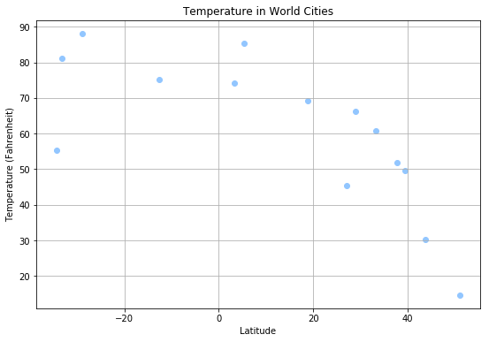
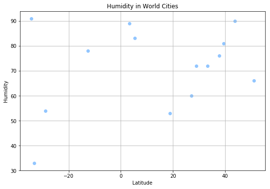
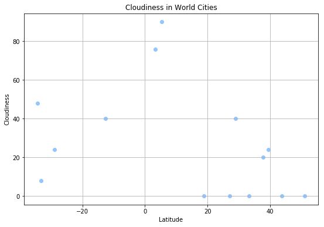
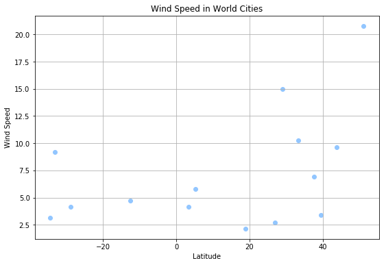

**Observed Trends:**

* Max temp are highest when closest to the Equator (latitude numbers closest to zero)
* There is no defined observable pattern between cloudiness and latitude
* Wind Speeds tend to remain below 20mph and anything above that appears to be an outlier


```python
# Dependencies
import json
import requests
from api_key_file import api_key
from citipy import citipy
import numpy as np
import requests as req
import pandas as pd
import matplotlib.pyplot as plt
import time
import csv
import seaborn as sns
```


```python
# Save config information
url = "http://api.openweathermap.org/data/2.5/weather?"
units = "imperial" 
params = {"appid": api_key,
          "q": cities}
```


```python
# Build partial query URL
query_url = url + "appid=" + api_key + "&units=" + units + "&q="
```


```python
cities = []

for coordinate_pair in range(0,14):  
    lat = randint(-60, 55)
    lon = randint(-95, 60)
    city = citipy.nearest_city(lat, lon)
    cities.append(city.city_name)

cities
```


    ['mar del plata',
     'bursa',
     'lima',
     'taolanaro',
     'lebu',
     'saint-philippe',
     'chuy',
     'morondava',
     'pisco',
     'wloszczowa',
     'taolanaro',
     'mayumba',
     'pimentel',
     'la rioja']


```python
weather_json_l = []

# Loop through the list of cities and perform a request for data on each
for city in cities:
    response = req.get(query_url + city).json()
    weather_json_l.append(response)
#     time.sleep(1)
```


```python
# Extract data from responses
try:
    lat_data = [data.get("coord").get("lat") for data in weather_json_l]
    temp_data = [data.get("main").get("temp") for data in weather_json_l]
    humidity_data = [data.get("main").get("humidity") for data in weather_json_l]
    cloud_data = [data.get("clouds").get("all") for data in weather_json_l]
    wind_speed = [data.get("wind").get("speed") for data in weather_json_l]
    
except (AttributeError, ValueError):    
    pass

city = [data.get("name") for data in weather_json_l]
#print(len(lat_data), len(temp_data), len(humidity_data), len(cloud_data), len(wind_speed), len(city))
weather_dict = {"Temperature (Fahrenheit)": temp_data, 
                    "Latitude": lat_data, 
                    "Humidity": humidity_data, 
                    "Cloudiness": cloud_data,
                    "Wind Speed": wind_speed,
                    "city":city}
weather_df = pd.DataFrame(weather_dict)

weather_df
```


<div>
<style scoped>
    .dataframe tbody tr th:only-of-type {
        vertical-align: middle;
    }

    .dataframe tbody tr th {
        vertical-align: top;
    }

    .dataframe thead th {
        text-align: right;
    }
</style>
<table border="1" class="dataframe">
  <thead>
    <tr style="text-align: right;">
      <th></th>
      <th>Cloudiness</th>
      <th>Humidity</th>
      <th>Latitude</th>
      <th>Temperature (Fahrenheit)</th>
      <th>Wind Speed</th>
      <th>city</th>
    </tr>
  </thead>
  <tbody>
    <tr>
      <th>0</th>
      <td>48</td>
      <td>91</td>
      <td>-34.42</td>
      <td>55.20</td>
      <td>3.15</td>
      <td>Mar del Plata</td>
    </tr>
    <tr>
      <th>1</th>
      <td>0</td>
      <td>53</td>
      <td>18.90</td>
      <td>69.11</td>
      <td>2.15</td>
      <td>Bursa</td>
    </tr>
    <tr>
      <th>2</th>
      <td>0</td>
      <td>66</td>
      <td>51.12</td>
      <td>14.63</td>
      <td>20.80</td>
      <td>Lima</td>
    </tr>
    <tr>
      <th>3</th>
      <td>24</td>
      <td>81</td>
      <td>39.51</td>
      <td>49.58</td>
      <td>3.38</td>
      <td>None</td>
    </tr>
    <tr>
      <th>4</th>
      <td>40</td>
      <td>78</td>
      <td>-12.58</td>
      <td>75.20</td>
      <td>4.70</td>
      <td>Lebu</td>
    </tr>
    <tr>
      <th>5</th>
      <td>0</td>
      <td>60</td>
      <td>27.03</td>
      <td>45.48</td>
      <td>2.71</td>
      <td>Saint-Philippe</td>
    </tr>
    <tr>
      <th>6</th>
      <td>90</td>
      <td>83</td>
      <td>5.28</td>
      <td>85.33</td>
      <td>5.82</td>
      <td>Chuy</td>
    </tr>
    <tr>
      <th>7</th>
      <td>8</td>
      <td>33</td>
      <td>-33.21</td>
      <td>81.17</td>
      <td>9.19</td>
      <td>Morondava</td>
    </tr>
    <tr>
      <th>8</th>
      <td>76</td>
      <td>89</td>
      <td>3.34</td>
      <td>74.28</td>
      <td>4.16</td>
      <td>Pisco</td>
    </tr>
    <tr>
      <th>9</th>
      <td>24</td>
      <td>54</td>
      <td>-28.95</td>
      <td>88.19</td>
      <td>4.16</td>
      <td>Wloszczowa</td>
    </tr>
    <tr>
      <th>10</th>
      <td>0</td>
      <td>90</td>
      <td>43.74</td>
      <td>30.14</td>
      <td>9.64</td>
      <td>None</td>
    </tr>
    <tr>
      <th>11</th>
      <td>20</td>
      <td>76</td>
      <td>37.73</td>
      <td>51.80</td>
      <td>6.93</td>
      <td>Mayumba</td>
    </tr>
    <tr>
      <th>12</th>
      <td>0</td>
      <td>72</td>
      <td>33.30</td>
      <td>60.80</td>
      <td>10.29</td>
      <td>Pimentel</td>
    </tr>
    <tr>
      <th>13</th>
      <td>40</td>
      <td>72</td>
      <td>29.06</td>
      <td>66.20</td>
      <td>14.99</td>
      <td>La Rioja</td>
    </tr>
  </tbody>
</table>
</div>


```python
#Save df to CSV
weather_df.to_csv("Weather_Analysis")
```


```python
#Temperature vs. Latitude
# Build a scatter plot for each data type
# sns color palette: deep, muted, bright, pastel, dark, colorblind
plt.figure(figsize=(9,6))
plt.scatter(weather_df["Latitude"], 
            weather_df["Temperature (Fahrenheit)"], 
            marker="o", 
            c=sns.color_palette("pastel", n_colors=1))

# Incorporate the other graph properties
plt.title("Temperature in World Cities")
plt.ylabel("Temperature (Fahrenheit)")
plt.xlabel("Latitude")
plt.grid(True)

# Save the figure
plt.savefig("TemperatureInWorldCities2.png")

# Show plot
plt.show()
```





```python
#Temperature vs. Latitude
# Build a scatter plot for each data type
plt.figure(figsize=(9,6))
plt.scatter(weather_df["Latitude"], 
            weather_df["Humidity"], 
            marker="o", 
            c=sns.color_palette("pastel", n_colors=1))

# Incorporate the other graph properties
plt.title("Humidity in World Cities")
plt.ylabel("Humidity")
plt.xlabel("Latitude")
plt.grid(True)

# Save the figure
plt.savefig("HumidityInWorldCities2.png")

# Show plot
plt.show()
```





```python
#Temperature vs. Latitude
# Build a scatter plot for each data type
plt.figure(figsize=(9,6))
plt.scatter(weather_df["Latitude"], 
            weather_df["Cloudiness"], 
            marker="o", 
            c=sns.color_palette("pastel", n_colors=1))

# Incorporate the other graph properties
plt.title("Cloudiness in World Cities")
plt.ylabel("Cloudiness")
plt.xlabel("Latitude")
plt.grid(True)

# Save the figure
plt.savefig("CloudinessInWorldCities2.png")

# Show plot
plt.show()
```





```python
#Temperature vs. Latitude
# Build a scatter plot for each data type
plt.figure(figsize=(9,6))
plt.scatter(weather_df["Latitude"], 
            weather_df["Wind Speed"], 
            marker="o", 
            c=sns.color_palette("pastel", n_colors=1))

# Incorporate the other graph properties
plt.title("Wind Speed in World Cities")
plt.ylabel("Wind Speed")
plt.xlabel("Latitude")
plt.grid(True)

# Save the figure
plt.savefig("WindSpeedInWorldCities2.png")

# Show plot
plt.show()
```




